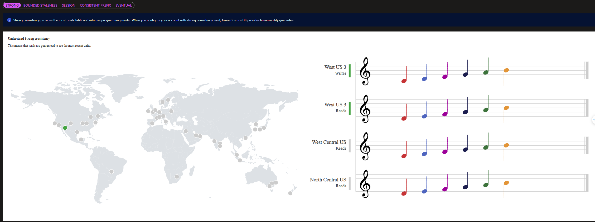
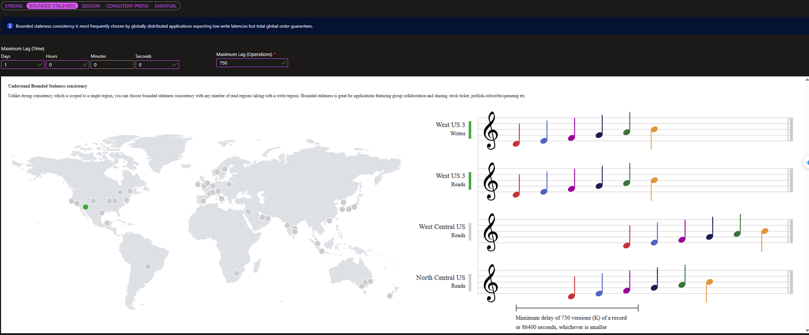
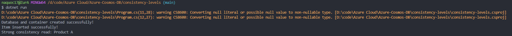

# The 5 consistency level

- From strongest to weakest, the consistency levels in Azure Cosmos DB are:
  1. Strong Consistency
  2. Bounded Staleness
  3. Session
  4. Consistent prefix
  5. Eventual

# Lab Exercise

- In this lab, we will configure and test the consistency levels

## Part 1: Create An Azure Cosmos DB Account and Configure Default Consistency

- Sign in to Azure portal
- Create a new Azure Cosmos DB account
  - Choose Azure Cosmos DB for NoSQL
  - Fill in the required fields: 
    - Account Name: Provide a unique name for your Cosmos DB account. 
    - Resource Group: Either create a new resource group or select an existing one. 
    - Location: Choose the region where your account will be hosted.
  - Once the deployment is complete, click Go to resource to navigate to your newly created Azure Cosmos DB account

## Part 2: Configure Default Consistency Level

- In the Cosmos DB account, go to the left-hand menu and search Default consistency oder find under Setting section
- The default level will be displayed (Session). We can change it by selecting one of following options:
  - Strong 
  - Bounded Staleness 
  - Session 
  - Consistent Prefix
  - Eventual
- Select strong consistency level and click Save
- The portal provdes a visualization of consistency levels using musical notes for understanding the trade-offs

## Part 3: Add Global Replication (optional)

- Go left hand menu and select Replicate data globally under Settings
- Add additional regions by clicking on the map
- Save changes and wait for replication setup

## Part 4: Testing Consistency Levels with Code

### Step 1: Install Dependencies

- Install Azure Cosmos DB SDK:

```cli
dotnet add package Microsoft.Azure.Cosmos
dotnet add package Newtonsoft.Json
```
### Step 2: Connect to Azure Cosmos DB account with key and Uri

- Code in file Program.cs

### Step 3: Run code and see the result

- Here is the result: 